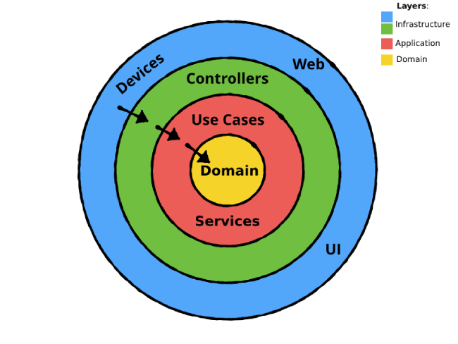

# Design Architecture

## Architectural Overview
The project adopts a **Hexagonal Architecture** **combined with Domain-Driven Design (DDD)**.  
This pairing isolates the pure *domain* model at the centre of the hexagon while structuring the codebase 
around well-defined bounded contexts and ubiquitous language, ensuring:

- **Loose coupling** between business rules and I/O mechanisms.
- **Straightforward automated testing** of the core, thanks to side effect–free domain code.
- **Easy replacement or evolution** of user interfaces and external services without impacting the domain 
or its ubiquitous language.
- **Clear, expressive models** that mirror business concepts, making the game logic easier to reason about 
and extend.

## Package Structure & Responsibilities

| Layer / Package                                                   | Main Responsibility                                                                                   | Key Classes (examples)                                                                                                 |
|-------------------------------------------------------------------|-------------------------------------------------------------------------------------------------------|------------------------------------------------------------------------------------------------------------------------|
| **Domain (`scalata.domain`)**                                     | Immutable business objects and rules; no side-effects.                                                | `Player`, `Enemy`, `Item`, `Room`, `World`, `GameSession`, `GameState`, value objects (`Direction`, `Point2D`).        |
| **Application (`scalata.application`)**                           | Pure application services & use-cases that orchestrate domain entities and encapsulate the game loop. | `FloorGenerator`, use-cases (`GameRunningUseCase`, `EnemyMovementUseCase`), factories (`EnemyFactory`, `ItemFactory`). |
| **Application - Input Ports**                                     | Abstract contracts that describe *what* the core can do.                                              | Traits exposed by use-cases (e.g., `CreatureUseCase`, `GameView`).                                                     |
| **Input Adapters**                                                | Translate external input into port calls (e.g., CLI & JLine controllers).                             | `ConsoleView`, `JLineView`, `MenuController`, `GameController`.                                                        |
| **Infrastructure (`scalata.infrastructure.view`, `…controller`)** | Concrete UI and system services.                                                                      | CLI/JLine launchers.                                                                                                   |

All dependencies point *inwards*: domain → application → ports → adapters. No inner layer imports symbols 
from an outer layer, satisfying the Dependency Inversion Principle.

## Static View (Hexagon)

## Domain-Driven Design Elements

1. **Entities** – `Player`, `Enemy`, `Item` (with subclasses `Potion`, `Weapon`, …).
2. **Value Objects** – `Point2D`, `Direction`, `PlayerCommand`.
3. **Aggregates** – `World` (root) containing `Room`s and `Player`.
4. **Domain Services** – `CombatEngine`, geometry utilities.
5. **Repositories / Persistence** – not yet needed; state is held in-memory via `GameSession`.

## Adherence to Clean Architecture Principles
- **DIP & ISP**: input/output ports are small, focused traits; adapters implement them, keeping the domain pure.
- **SRP**: each component handles a single concern (parsing, rendering, AI, etc.).
- **Open/Closed**: new UI (e.g., Swing front-end) can be added as another adapter without modifying 
existing core code.

## Extensibility Scenarios

| Scenario              | Required Change                                                   | Impact Radius         |
|-----------------------|-------------------------------------------------------------------|-----------------------|
| Add GUI (Swing/Web)   | Implement new *input & output adapters* against existing ports.   | Adapters only         |
| New Item type         | Add concrete `Item` subclass & entry in `ItemFactory`.            | Domain + factory      |
| Boss AI               | New use-case handler plus strategy injected into `AIEngine`.      | Application layer     |
| Persist replays       | Create `ReplayRepository` (output port) + adapter to file/DB.     | Application + adapter |

Thanks to the Ports-and-Adapters approach, each scenario remains localized and does **not** ripple into the domain core.

### Summary of Benefits
- **Testability** – pure domain code, deterministic RNG seeds, and a single-threaded loop simplify unit 
& property tests.
- **Maintainability** – strict package boundaries and scalafmt keep the codebase clean.
- **Scalability** – performance hotspots are confined to `AIEngine` and `FloorGenerator`, 
allowing future parallelization under the same ports.
- **Portability** – runs on any JVM 17+ environment; UI adapters can target console or desktop 
without changing the game rules.

This design positions *Scalata* for incremental growth—new gameplay mechanics and presentation layers 
can be added with confidence that existing behaviour will remain stable.
