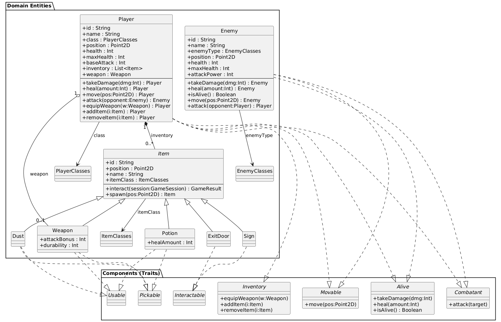
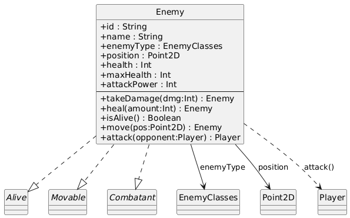
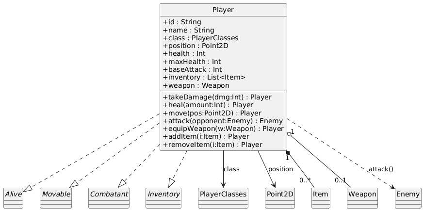
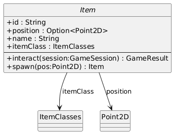
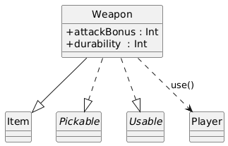
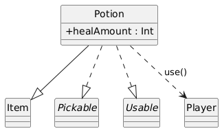
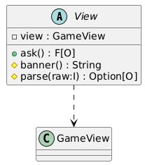
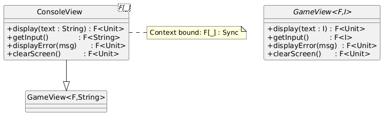
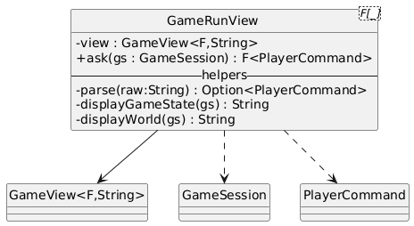

# Detailed Design

This chapter outlines the detailed design choices implemented in the Scalata project, diving into the code-base 
organisation, the architectural patterns adopted, and the technical decisions that guided development.  
The system architecture follows **Hexagonal Architecture** principles combined with **Domain-Driven Design (DDD)**, ensuring a clear separation between business logic and I/O mechanisms.

## Package Structure

The code-base is divided into main packages that mirror the layers of the hexagonal architecture:


### Package Overview

The Scalata project is divided into three concentric layers—**domain**, **application**, 
and **infrastructure**—mirroring a classic Hexagonal Architecture.  
Each layer is further split into sub-packages whose names describe their exact responsibility.

#### 1. `scalata.domain`

*The pure heart of the application—no I/O, no frameworks.*

* **`entities`**  
  *Fine-grained objects such as*  
  `Player`, `Enemy`, `Item`.  
  They expose intentful methods (`move`, `receiveDamage`, `useItem`) that return new instances, 
never mutating themselves.

* **`world`**  
  Aggregates that group several entities and guarantee invariants:  
  `Room` (geometry + occupants), `Floor` (connected rooms), `World` (vector of floors), and `GameSession` 
(the single source of truth for a running game).  
  Factory methods in each companion object ensure illegal states are un-representable.

* **`util`**  
  Small, pure utilities—coordinate math (`Point2D`), cardinal directions, random helpers, validation combinators.  
  Nothing here imports from any other layer.

#### 2. `scalata.application`

*Pure orchestration and workflow.*

* **`usecases`**  
  Each class models exactly **one** “verb” from the requirement specification. Examples:  
  `StartGame` seeds the first world, `MovePlayer` applies a direction and updates combat checks, 
`EnemyTurn` asks the AI for moves and updates the world accordingly.  
  All logic remains side-effect-free behind an effect type `F[_]`; this lets tests swap `IO` 
with a deterministic mock.

* **`services`**  
  Shared control logic that multiple use-cases rely on:  
  `FloorGenerator` builds deterministic levels from a seed; `GamePhaseService` 
runs the finite-state machine for *Menu → Playing → Game Over*; 
`EnemyAI` wraps the Prolog engine and transforms game state into AI decisions.

* **`ports`**  
  Pure traits that define both **inbound** (“driven”) and **outbound** (“driving”) interfaces.  
  Example:

  ```scala
  trait GameView[F[_], I]:
    def display[A](text: A): F[Unit]
    def getInput: F[I]
    def displayError[A](message: A): F[Unit]
    def clearScreen: F[Unit]
  ```

  The application layer depends only on these abstractions, never on concrete I/O.

#### 3. `scalata.infrastructure`

*Everything that touches the outside world.*

* **`controller`**  
  Translates user input into domain operations. `GameController` pulls commands from a `GameView`, 
invokes the right use-case, and feeds the updated session back to the view. 
`MenuController` does the same for start-up menus.

* **`view`**  
  Concrete UIs that implement `GameView`:

  * `ConsoleView`—ANSI terminal rendering with colourful ASCII art.
  * `TestView`—headless stub that returns scripted input for unit tests.
  * Future GUI adapters can be added here without touching the rest of the code-base.

### How the Layers Interact

1. **Infrastructure** receives an event (key press).
2. A **controller** maps the event to a **use-case** call.
3. The **use-case** pulls & updates **domain** objects, possibly invoking an application **service**.
4. The modified, *pure* `GameSession` is returned to the controller.
5. The **view** renders the new state.

Because dependencies flow strictly *inwards*, you can replace any outer package 
(e.g., swap `ConsoleView` for a GUI) without recompiling the core layers.


## Architectural Patterns

### Hexagonal Architecture with Domain-Driven Design (DDD)

Hexagonal Architecture (also called *Ports & Adapters*) and DDD complement each other, 
giving a project like **Scalata** a clear, test-friendly structure.

#### 1  Core idea
1. Place **business concepts** (the Domain) at the centre.
2. Wrap them with an **Application layer** that orchestrates use-cases without knowing *how* I/O happens.
3. Connect the outside world (UI, databases, Prolog engine, files, network, etc.) through thin 
**Infrastructure adapters** that implement or drive the ports declared in the Application layer.

#### 2  Dependency rules
- **Only inward references**: infrastructure → application → domain (never the opposite).
- **Domain** has *no* dependency on external libraries except for lightweight FP datatypes; 
it exposes intent-rich methods (`attack`, `pickUp`, `move`) instead of setters.
- **Application** depends on the Domain but talks to Infrastructure only via *abstract* ports 
(`GameView`).
- **Infrastructure** is free to rely on any technology stack (Cats-Effect, tuProlog, JSON, Swing); 
changing or replacing it never ripples back into core logic.

#### 3  Benefits in practice

| Aspect                   | Why it helps                                                                                                                  | Example in Scalata                                                                                              |
|--------------------------|-------------------------------------------------------------------------------------------------------------------------------|-----------------------------------------------------------------------------------------------------------------|
| **Isolation & testing**  | Domain and Application layers are pure; they can be unit- or property-tested without running the console, AI, or file system. | `EnemyMovementUseCase` is tested with a TestView stub; no ANSI rendering is involved.                           |
| **Pluggable interfaces** | A new presentation layer (e.g., GUI, web) is a *single* adapter implementing `GameView`; no other code changes.               | Swap `ConsoleView` with a future ScalaFX view by wiring it in `Main.scala`.                                     |
| **Safe evolution**       | Outer-layer refactors cannot break domain invariants because dependencies are one-way.                                        | Prolog engine can be replaced by an A* path-finder written in Scala without touching `Enemy`.                   |
| **Clear ownership**      | Each concern has a unique home—business rules in Domain, workflows in Application, devices in Infrastructure.                 | Inventory capacity logic lives in `Player`.                                                                     |
| **Tech agnosticism**     | Core stays independent from frameworks, keeping compile times low and portability high.                                       | Domain compiles on Scala JVM, ScalaJS, or Native if desired.                                                    |

#### 4  Typical workflow of a game turn


## Entities

The following section details the **static entities**.  



### 1.1 Enemy

A hostile creature driven by the AI.



**Behavioural mix-ins**
* Alive – `takeDamage`, `heal`, `isAlive`
* Movable – `move(newPos)`
* Combatant – `attack(target: Player)`

### 1.2 Player

Embodies the user-controlled hero and owns an inventory.



**Behavioural mix-ins**
* Alive – HP management
* Movable – Spatial translation
* Combatant – `attack(opponent: Enemy)`
* Inventory – item handling (`equipWeapon`, `addItem`, …)

### 1.3 Item Hierarchy

All pickable or interactable objects inherit from the abstract `Item`.

| «trait» Item                       |                                             |
|------------------------------------|---------------------------------------------|
| **id** : String                    | Persistent identifier                       |
| **position** : Option              | *Some(p)* when on floor, `None` once picked |
| **name** : String                  | Label shown to the player                   |
| **itemClass** : ItemClasses        | Functional grouping (*Weapon*, *Potion*, …) |
| **interact(session)** : GameResult | Context action (e.g., pick up)              |
| **spawn(pos)** : Item              | Copy of the item at a new position          |



#### 1.3.1 Weapon



*Interactions*  
– Pickable: transferred to inventory 
– Usable: equips itself and removes from bag

#### 1.3.2 Potion



*Interactions*  
– Pickable → inventory 
– Usable → heals the owner, then destroys itself

#### 1.3.3 Dust

Flavour collectible with no gameplay effect; still pickable for achievements.

#### 1.3.4 Sign

Displays the current tower level without mutating the world state.

#### 1.3.5 ExitDoor

Moves the player to the next floor and increments `GameState.currentLevel` on success.

### 2 Cross-cutting Capabilities (Traits)

| Capability   | Purpose                   | Key Methods                                                                  |
|--------------|---------------------------|------------------------------------------------------------------------------|
| Alive        | Life-cycle management     | `takeDamage`, `heal`, `isAlive`                                              |
| Movable      | Position updates          | `move(newPos)`                                                               |
| Combatant    | Fighting interface        | `attack(target)`                                                             |
| Inventory    | Item storage & equipment  | `equipWeapon`, `addItem`, `removeItem`                                       |
| Interactable | World interaction hook    | `interact(session)`                                                          |
| Pickable     | Collect item from floor   | `pick(item, session)`                                                        |
| Usable       | Contextual use of an item | `use(item, owner)` with given instances for **Potion**, **Weapon**, **Dust** |

These traits are **orthogonal**; concrete entities mix only the capabilities they need, 
keeping the model lean and extensible.

### 3 Design Principles Adopted

* **Immutability first** – every state change returns a fresh value object; no in-place mutation.
* **Type-class architecture** – separates *data* (case classes) from *behaviour* (traits), 
promoting reuse and testability.
* **Compile-time safety** – enumerations and generic constraints prevent invalid combinations 
(e.g., a non-pickable Sign cannot be mis-used).

## View

The *view* package renders the game on a text console and gathers user input while remaining 
**UI-technology agnostic**.  
It is split into three concentric circles:

1. **UI-independent façade** (`GameView`)
2. **UI-specific adaptors** (`ConsoleView`, `JLineView`)
3. **High-level screens** (`MenuView`, `GameRunView`, …) that orchestrate banner creation and input parsing.

### 1 Core Abstractions

#### 1.1 `GameView[F, I]`
A *polymorphic interface* that lifts all I/O operations into any effect `F` supporting `cats.effect.Sync`:

| Operation                 | Purpose                 |
|---------------------------|-------------------------|
| `display[A](text: A)`     | Write arbitrary content |
| `getInput`                | Read a line (blocking)  |
| `displayError[A](msg: A)` | Highlight invalid input |
| `clearScreen`             | full refresh            |

`GameView` is the **sole contract** known by upper layers (controllers). 
Everything below it can change without ripple effects.

#### 1.2 `View`
A *template* that factors common logic for interactive screens:

* **Banner** generation (`banner` val)
* **Raw-to-domain parsing** (`parse`)
* **Loop** that re-asks until parsing succeeds (`Shared.run`)

It is parameterised on:

```
V = concrete subclass
I = raw input
O = domain output
E = error type shown to the user
F = effect
```



### 2 Low-Level I/O Adaptors

| Class            | Technology         | Responsibilities                                                  |
|------------------|--------------------|-------------------------------------------------------------------|
| `ConsoleView[F]` | **StdIn / StdOut** | Implements `GameView` with plain Scala I/O and ANSI clear-screen. |
| `JLineView[F]`   | **JLine v3**       | Rich terminal (non-blocking reader, key echo control).            |



**Design highlights**

* Both classes *bridge* the abstract `GameView` interface: 
the rest of the codebase stays unchanged when swapping I/O backend.
* `JLineView` guards the `Terminal` inside a `Resource`, 
applying the **RAII** pattern to avoid file-descriptor leaks.

### 3 Interactive Screens

Every screen subclasses `View`, specialises `banner` and `parse`, and exposes an `ask` method to its controller.

| Screen            | Domain output   | Short description                                                   |
|-------------------|-----------------|---------------------------------------------------------------------|
| `MenuView`        | `Boolean`       | “Start game? y/n”                                                   |
| `ChampSelectView` | `PlayerClasses` | Choose class (Mage, Barbarian, Assassin)                            |
| `GameRunView`     | `PlayerCommand` | Main gameplay HUD; prints world map and interprets complex commands |
| `GameOverView`    | `Boolean`       | Ask to return to menu                                               |
| `HelpView`        | n/a             | Static help string                                                  |


#### 3.1 `GameRunView` – key points
* Builds an ASCII **mini-map** from `GameSession`, painting rooms, doors, items, player symbol and enemies.
* Parses multi-token commands (`"c n"`, `"u potion"`, `"undo"` …) with pattern matching.
* Encapsulates rendering helpers (`getCellDisplay`, `findDoorSymbol`, …) for *single responsibility*.



### 4 Shared Utilities

#### 4.1 `Shared` object
* **Controller router** – returns the `GameControllerState ⇒ Controller[F]` map, 
injecting the chosen `view` instance into every screen.
* **Generic run-loop** – repeatedly queries `GameView.getInput` until `parse` succeeds.
* **Helper parsers** – e.g., `booleanParse`.

### 5 Command-Line Entry Points

* `CliApp` – Bootstrap with `ConsoleView`, then hand control to `GameEngine.gameLoop`.
* `JLineApp` – Same, but wraps `JLineView` in a `Resource` to guarantee terminal closure.

### 6 Interaction Workflow

1. **App** constructs a concrete `GameView` implementation.
2. It passes that instance to `Shared.getControllersMap`, wiring every controller to 
its corresponding *screen* (`View` subclass).
3. `GameEngine` drives the state machine:
  * asks the current controller ➞
  * controller delegates to its screen’s `ask` ➞
  * screen uses `GameView` to render banners and read input.
4. On shutdown, resources (JLine terminal) are released automatically.

### 7 Design Principles Applied

* **Bridge pattern** – separates *what* the game wants to display (`GameView`) from *how* 
it is displayed (`ConsoleView`, `JLineView`).
* **Template Method** – `View` fixes the input loop while letting subclasses customise banner and parsing.
* **Dependency Injection** – every screen receives a `GameView` in its constructor, enabling pure 
unit testing with mocks.
* **Functional purity** – all public methods remain referentially transparent; 
side effects live inside the `F` context.
