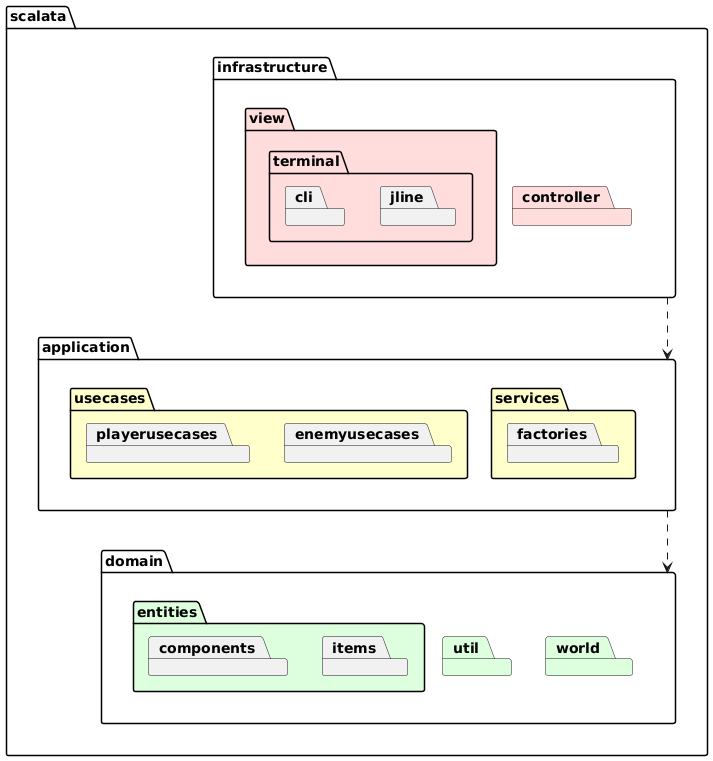
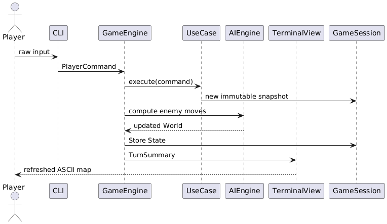

Here is the requested English translation.

# Detailed Design

This chapter outlines the detailed design choices implemented in the Scalata project, diving into the code-base 
organisation, the architectural patterns adopted, and the technical decisions that guided development.  
The system architecture follows **Hexagonal Architecture** principles combined with **Domain-Driven Design (DDD)**, ensuring a clear separation between business logic and I/O mechanisms.

## Package Structure

The code-base is divided into main packages that mirror the layers of the hexagonal architecture:



### Package Overview

The Scalata project is divided into three concentric layers—**domain**, **application**, 
and **infrastructure**—mirroring a classic Hexagonal Architecture.  
Each layer is further split into sub-packages whose names describe their exact responsibility.

#### 1. `scalata.domain`

*The pure heart of the application—no I/O, no frameworks.*

* **`entities`**  
  *Fine-grained objects such as*  
  `Player`, `Enemy`, `Item`.  
  They expose intentful methods (`move`, `receiveDamage`, `useItem`) that return new instances, 
never mutating themselves.

* **`world`**  
  Aggregates that group several entities and guarantee invariants:  
  `Room` (geometry + occupants), `Floor` (connected rooms), `World` (vector of floors), and `GameSession` 
(the single source of truth for a running game).  
  Factory methods in each companion object ensure illegal states are un-representable.

* **`util`**  
  Small, pure utilities—coordinate math (`Point2D`), cardinal directions, random helpers, validation combinators.  
  Nothing here imports from any other layer.

#### 2. `scalata.application`

*Pure orchestration and workflow.*

* **`usecases`**  
  Each class models exactly **one** “verb” from the requirement specification. Examples:  
  `StartGame` seeds the first world, `MovePlayer` applies a direction and updates combat checks, 
`EnemyTurn` asks the AI for moves and updates the world accordingly.  
  All logic remains side-effect-free behind an effect type `F[_]`; this lets tests swap `IO` 
with a deterministic mock.

* **`services`**  
  Shared control logic that multiple use-cases rely on:  
  `FloorGenerator` builds deterministic levels from a seed; `GamePhaseService` 
runs the finite-state machine for *Menu → Playing → Game Over*; 
`EnemyAI` wraps the Prolog engine and transforms game state into AI decisions.

* **`ports`**  
  Pure traits that define both **inbound** (“driven”) and **outbound** (“driving”) interfaces.  
  Example:

  ```scala
  trait GameView[F[_], I]:
    def display[A](text: A): F[Unit]
    def getInput: F[I]
    def displayError[A](message: A): F[Unit]
    def clearScreen: F[Unit]
  ```

  The application layer depends only on these abstractions, never on concrete I/O.

#### 3. `scalata.infrastructure`

*Everything that touches the outside world.*

* **`controller`**  
  Translates user input into domain operations. `GameController` pulls commands from a `GameView`, 
invokes the right use-case, and feeds the updated session back to the view. 
`MenuController` does the same for start-up menus.

* **`view`**  
  Concrete UIs that implement `GameView`:

  * `ConsoleView`—ANSI terminal rendering with colourful ASCII art.
  * `TestView`—headless stub that returns scripted input for unit tests.
  * Future GUI adapters can be added here without touching the rest of the code-base.

### How the Layers Interact

1. **Infrastructure** receives an event (key press).
2. A **controller** maps the event to a **use-case** call.
3. The **use-case** pulls & updates **domain** objects, possibly invoking an application **service**.
4. The modified, *pure* `GameSession` is returned to the controller.
5. The **view** renders the new state.

Because dependencies flow strictly *inwards*, you can replace any outer package 
(e.g., swap `ConsoleView` for a GUI) without recompiling the core layers.


## Architectural Patterns

### Hexagonal Architecture with Domain-Driven Design (DDD)

Hexagonal Architecture (also called *Ports & Adapters*) and DDD complement each other, 
giving a project like **Scalata** a clear, test-friendly structure.

#### 1  Core idea
1. Place **business concepts** (the Domain) at the centre.
2. Wrap them with an **Application layer** that orchestrates use-cases without knowing *how* I/O happens.
3. Connect the outside world (UI, databases, Prolog engine, files, network, etc.) through thin 
**Infrastructure adapters** that implement or drive the ports declared in the Application layer.


#### 2  Dependency rules
- **Only inward references**: infrastructure → application → domain (never the opposite).
- **Domain** has *no* dependency on external libraries except for lightweight FP datatypes; 
it exposes intent-rich methods (`attack`, `pickUp`, `move`) instead of setters.
- **Application** depends on the Domain but talks to Infrastructure only via *abstract* ports 
(`GameView`).
- **Infrastructure** is free to rely on any technology stack (Cats-Effect, tuProlog, JSON, Swing); 
changing or replacing it never ripples back into core logic.

#### 3  Benefits in practice

| Aspect                   | Why it helps                                                                                                                  | Example in Scalata                                                                                              |
|--------------------------|-------------------------------------------------------------------------------------------------------------------------------|-----------------------------------------------------------------------------------------------------------------|
| **Isolation & testing**  | Domain and Application layers are pure; they can be unit- or property-tested without running the console, AI, or file system. | `EnemyMovementUseCase` is tested with a TestView stub; no ANSI rendering is involved.                           |
| **Pluggable interfaces** | A new presentation layer (e.g., GUI, web) is a *single* adapter implementing `GameView`; no other code changes.               | Swap `ConsoleView` with a future ScalaFX view by wiring it in `Main.scala`.                                     |
| **Safe evolution**       | Outer-layer refactors cannot break domain invariants because dependencies are one-way.                                        | Prolog engine can be replaced by an A* path-finder written in Scala without touching `Enemy` or `World`.        |
| **Clear ownership**      | Each concern has a unique home—business rules in Domain, workflows in Application, devices in Infrastructure.                 | Inventory capacity logic lives in `Player`.                                                                     |
| **Tech agnosticism**     | Core stays independent from frameworks, keeping compile times low and portability high.                                       | Domain compiles on Scala JVM, ScalaJS, or Native if desired.                                                    |
| **Parallel development** | Teams can work on layers concurrently with mock implementations.                                                              | While one teammate designs a GUI adapter, another improves `FloorGenerator`—no merge conflicts on shared files. |

#### 4  Typical workflow of a game turn




## Monad Pattern with Cats Effect

The project leverages the **Monad** pattern via Cats Effect `IO` to handle side effects functionally:

```scala
trait GameView[F[_], I]:
  def display[A](text: A): F[Unit]
  def getInput: F[I]
  def displayError[A](message: A): F[Unit]
  def clearScreen: F[Unit]
```

*Effect polymorphism* through the `F[_]` type parameter lets the same code:

- Abstract over the effect type
- Use mock effects during tests
- Preserve functional purity
- Support multiple runtimes (`IO`, `SyncIO`, `State`, …)

## State Management with `NonEmptyList`

Game state history is kept in `cats.data.NonEmptyList` to guarantee an immutable, non-empty log of sessions:

```scala
def store: GameSession =
  copy(history = NonEmptyList(getSession, history.toList))

def undo: GameSession =
  history.tail.toNel.fold(
    updateGameState(getGameState.withNote(GameError.UndoError().message))
  ) { t =>
    copy(
      world = t.head._1,
      gameState = t.head._2,
      history = t
    )
  }
```

Key points:

- Immutable snapshot after every operation
- Compile-time safety (history is never empty)
- Simple, side-effect-free undo/redo
- Concurrency friendly when paired with `Ref[IO, GameSession]`

